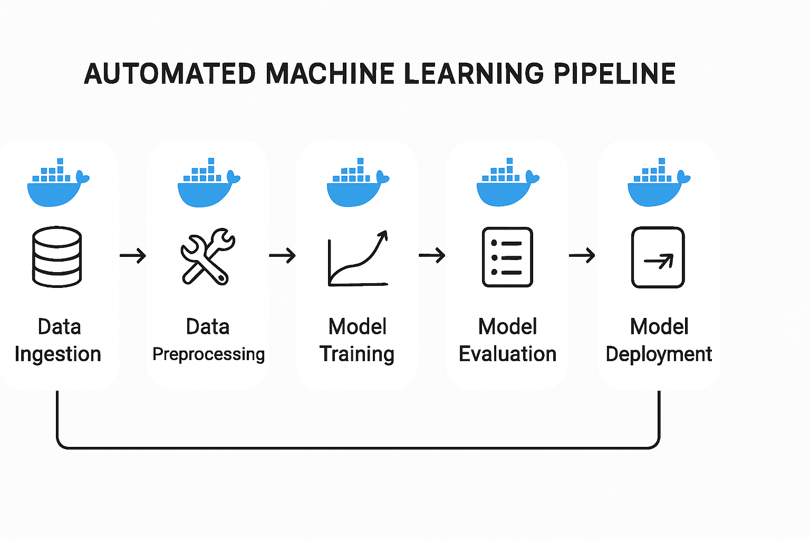

# SmartScale ML Pipeline

## Project Overview

This project implements an automated Machine Learning (ML) pipeline for training and deploying models, leveraging Docker for containerization. The pipeline is designed to be robust, scalable, and easy to reproduce.

## Architecture

The SmartScale ML Pipeline consists of the following key components:

1.  **Data Ingestion**: Handles loading and initial processing of raw data.
2.  **Model Training**: Trains the ML model using the processed data.
3.  **Model Evaluation**: Assesses the performance of the trained model.
4.  **Model Registry**: Stores trained models and their metadata.
5.  **Model Deployment**: Deploys the best performing model as a service.
6.  **Docker Containerization**: Encapsulates each component for isolated and consistent execution.
7.  **Automation Scripts**: Orchestrates the entire pipeline, from training to deployment.

## Directory Structure

```
smartscale_ml_pipeline/
├── README.md
├── data/
│   └── raw_data.csv
├── src/
│   ├── __init__.py
│   ├── data_preprocessing.py
│   ├── model_training.py
│   ├── model_evaluation.py
│   └── model_serving.py
├── models/
├── docker/
│   ├── Dockerfile.train
│   ├── Dockerfile.serve
│   └── docker-compose.yml
├── scripts/
│   ├── train_pipeline.sh
│   └── deploy_pipeline.sh
├── tests/
│   ├── test_data_preprocessing.py
│   ├── test_model_training.py
│   └── test_model_serving.py
└── requirements.txt
```


## Usage

To use this ML pipeline, follow these steps:

### Prerequisites

- Docker and Docker Compose installed on your system.

### 1. Build and Train the Model

Navigate to the `smartscale_ml_pipeline` directory and run the training script:

```bash
cd smartscale_ml_pipeline
./scripts/train_pipeline.sh
```

This script will:
- Build the `ml_training` Docker image.
- Run the training container, which preprocesses data, trains the model, and saves it to the `models/` directory.

### 2. Deploy the Model Serving API

After training, deploy the model as a RESTful API:

```bash
./scripts/deploy_pipeline.sh
```

This script will:
- Build the `ml_serving` Docker image.
- Start the model serving API in a detached Docker container, accessible on `http://localhost:5000`.

### 3. Test the API

You can test the deployed API using `curl` or any HTTP client. For example:

```bash
curl -X POST -H "Content-Type: application/json" -d "{\"feature1\": [6, 7], \"feature2\": [0, 1]}" http://localhost:5000/predict
```

To check the health of the service:

```bash
curl http://localhost:5000/health
```

## Testing

Unit tests are provided for core components. To run them:

```bash
python3 -m unittest tests/test_data_preprocessing.py
python3 -m unittest tests/test_model_training.py
# For model serving tests, ensure the API is running first
python3 -m unittest tests/test_model_serving.py
```

## Future Enhancements

- Integration with a proper MLflow or DVC for experiment tracking and versioning.
- CI/CD pipeline integration for automated testing and deployment.
- More sophisticated model evaluation metrics and visualizations.
- Support for different model types and hyperparameter tuning.
- Scalable deployment using Kubernetes.


## ML Pipeline Architecture




